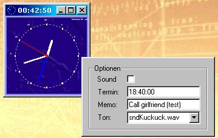



## Ci Analog \(Alarm\) Clock 1\.0

### Description

An analog clock with alarm function to remind the developer of real life ;-)   Features: resizes with form, optional Ticking, Wave File Sound Alarm or Beeping (two wav-Files included), rightclick for options
 
### More Info
 
userinterface is in german (if somebody is really eager I´ll quickly translate that to english on request)

             |
---                |---
**Submitted On**   |2002-01-09 00:24:40
**By**             |[Ian C\.](https://github.com/Planet-Source-Code/PSCIndex/blob/master/ByAuthor/ian-c.md)
**Level**          |Advanced
**User Rating**    |5.0 (30 globes from 6 users)
**Compatibility**  |VB 6\.0
**Category**       |[Custom Controls/ Forms/  Menus](https://github.com/Planet-Source-Code/PSCIndex/blob/master/ByCategory/custom-controls-forms-menus__1-4.md)
**World**          |[Visual Basic](https://github.com/Planet-Source-Code/PSCIndex/blob/master/ByWorld/visual-basic.md)
**Archive File**   |[CI\_Analog\_47297182002\.zip](https://github.com/Planet-Source-Code/ian-c-ci-analog-alarm-clock-1-0__1-30576/archive/master.zip)

